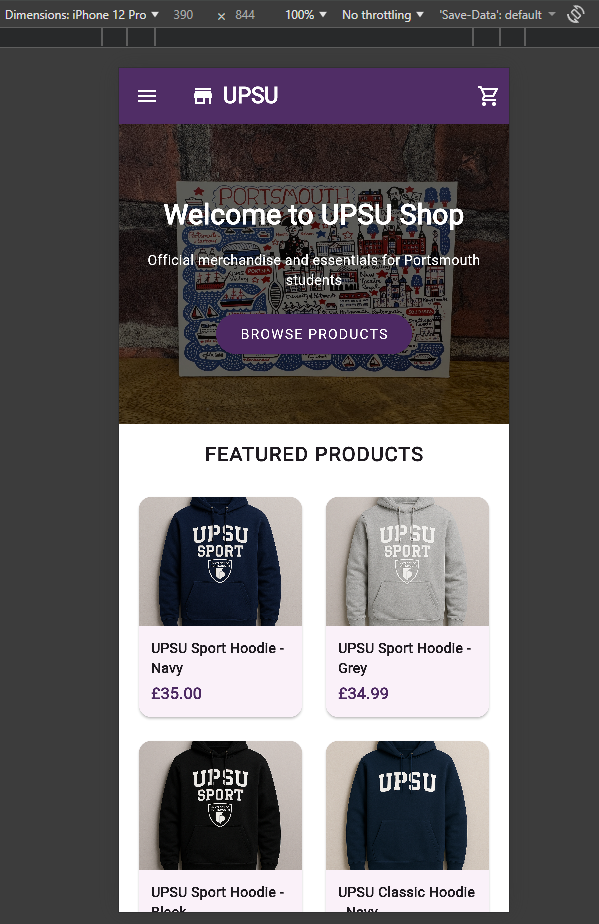

# UPSU Union Shop - Flutter E-Commerce Application

A responsive e-commerce platform built with Flutter, recreating the University of Portsmouth Students' Union shop. This coursework project demonstrates modern web development with Flutter and Firebase integration.



---

## 📋 Project Information

**Developer**: Chrystalla Tampouri (UP2257593)  
**Module**: M30235 - Programming Applications  
**University**: University of Portsmouth  
**Year**: 2 (2025/2026)  
**GitHub**: https://github.com/ChrystallaT1/union_shop

---

## ✨ Key Features

### Core Functionality

- 🛍️ **Product Browsing**: 11 products across 4 collections (Hoodies, T-Shirts, Accessories, Stationery)
- 🛒 **Shopping Cart**: Add/remove items, quantity management, price calculations
- 🔐 **User Authentication**: Firebase Auth with email/password login and registration
- 🔍 **Search & Filter**: Product search with sorting (price, name, popularity) and filtering (size, color, price range)
- 📱 **Responsive Design**: Mobile (<768px), Tablet (768-1024px), Desktop (>1024px) layouts
- 💰 **Sale Items**: Discounted products with original and sale prices
- ✏️ **Print Shack**: Product personalization interface

### Technical Highlights

- Real-time data with Cloud Firestore
- Local asset-based product images (no Firebase Storage dependency)
- Session persistence and cart management
- Clean architecture with services and models

---

## 🛠️ Technologies Used

**Framework & Language:**

- Flutter 3.x
- Dart 3.x

**Backend & Services:**

- Firebase Authentication - User management
- Cloud Firestore - Database for products, collections, user data
- **Note**: Product images stored as **local assets** (not Firebase Storage)

**State Management:**

- Provider ^6.1.1

**Development Tools:**

- VS Code with Flutter extension
- Flutter DevTools for debugging
- Git/GitHub for version control
- Chrome for web testing

---

## 📦 Installation & Setup

### Prerequisites

- Flutter SDK 3.0.0+
- Dart SDK (included with Flutter)
- Google Chrome browser
- Git

### Quick Start

```bash
# 1. Clone repository
git clone https://github.com/ChrystallaT1/union_shop.git
cd union_shop

# 2. Install dependencies
flutter pub get

# 3. Enable web support (if needed)
flutter config --enable-web

# 4. Run application
flutter run -d chrome

# 5. Optional: Run with HTML renderer
flutter run -d chrome --web-renderer html
```

### Verify Installation

- Homepage loads with UPSU branding
- Purple navigation bar visible
- Product collections display correctly
- No errors in terminal

**Common Issues:**

```bash
# If packages fail
flutter clean && flutter pub get

# Check Flutter installation
flutter doctor

# List available devices
flutter devices
```

---

## 📖 Usage Guide

### 1. Browse Products

- Click **Collections** in navbar
- Select a collection (Hoodies, T-Shirts, etc.)
- Use filters: Size (XS-XXL), Color, Price Range (£0-£100)
- Sort by: Popularity, Price (Low/High), Name (A-Z), Newest

### 2. View Product Details

- Click any product card
- Select size from dropdown
- Choose color (switches product variant)
- Set quantity using +/- buttons
- Click "Add to Cart"

### 3. Manage Cart

- View cart by clicking cart icon (shows item count)
- Adjust quantities with +/- buttons
- Remove items with trash icon
- See subtotal, shipping, and VAT calculations

### 4. User Account

- **Sign Up**: Click Login → Create Account
- **Log In**: Enter email and password
- **Dashboard**: View profile and account settings
- **Log Out**: Click logout button in account menu

### 5. Search Products

- Use search bar in navbar or footer
- Enter product name or keyword
- Results are filterable and sortable

### 6. Sale Items

- Click **Sale** in navbar
- View discounted products
- See original price (strikethrough) and sale price

---

## 🔥 External Services

### Firebase Authentication

**Purpose**: User registration, login, and session management

**Features:**

- Email/password authentication
- Secure password hashing
- Session persistence
- Account verification

**Implementation:**

```dart
// lib/services/auth_service.dart
- signUpWithEmail()
- signInWithEmail()
- signOut()
- currentUser getter
- authStateChanges stream
```

### Cloud Firestore Database

**Purpose**: Store products, collections, and user data

**Database Structure:**

```
Firestore
├── products (collection)
│   ├── 11 product documents
│   └── Fields: id, name, price, description, sizes, colors,
│       stockQuantity, isOnSale, salePrice, popularity, etc.
├── collections (collection)
│   └── 4 collection documents (Hoodies, T-Shirts, etc.)
└── users (collection)
    └── User documents with cart data
```

**Features:**

- Real-time data synchronization
- Offline data persistence
- Efficient querying and filtering
- Scalable cloud database

**Key Queries:**

```dart
// Fetch products by collection
.where('collectionId', isEqualTo: 'hoodies')

// Get sale items
.where('isOnSale', isEqualTo: true)

// Sort by popularity
.orderBy('popularity', descending: true)
```

### Important Note: Image Storage

**Product images are stored as LOCAL ASSETS** in the project, not in Firebase Storage.

**Image Location:**

```
assets/
└── images/
    └── products/
        ├── hoodie_upsu_navy.png
        ├── hoodie_upsu_black.png
        ├── tshirt_upsu_sports_black.png
        └── ... (11 images total)
```

**Configuration** (`pubspec.yaml`):

```yaml
flutter:
  assets:
    - assets/images/products/
```

**Why Local Assets?**

- Faster initial load times
- No external service dependency for images
- Simplified development and testing
- No additional Firebase Storage costs
- Images bundled with application

**Image References** in code use asset paths:

```dart
Image.asset('assets/images/products/hoodie_upsu_navy.png')
```

---

## 📁 Project Structure

```
lib/
├── main.dart                    # Entry point, routing, Firebase init
├── firebase_options.dart        # Firebase configuration
│
├── models/                      # Data structures
│   ├── product_model.dart
│   ├── cart_item_model.dart
│   └── personalization_model.dart
│
├── services/                    # Business logic
│   ├── auth_service.dart        # Authentication
│   ├── products_service.dart    # Product data (uses local assets)
│   ├── cart_service.dart        # Cart management
│   └── user_service.dart        # User data
│
├── views/                       # UI screens
│   ├── home/
│   ├── collections/
│   ├── collection/
│   ├── product/
│   ├── cart/
│   ├── auth/
│   ├── account/
│   ├── search/
│   ├── sale/
│   ├── about/
│   ├── personalization/
│   └── common/                  # Shared widgets (navbar, footer)
│
└── utils/
    └── constants.dart

assets/
└── images/
    └── products/                # LOCAL product images (NOT Firebase Storage)

test/
├── unit/
│   ├── model_tests.dart
│   └── services_test.dart
└── widget/
    ├── home_screen_test.dart
    ├── collections_screen_test.dart
    └── cart_screen_test.dart
```

---

## 🧪 Testing

### Run Tests

```bash
# All tests
flutter test

# Specific test file
flutter test test/unit/model_tests.dart

# With coverage
flutter test --coverage
```

### Test Coverage

- ✅ **Unit Tests**: ProductModel, CartItemModel, CartService (6 tests)
- ✅ **Widget Tests**: HomeScreen, CollectionsScreen, CartScreen (7 tests)
- ✅ **Total**: 13+ tests passing

### Sample Tests

```dart
// Unit Test - Product Model
test('Product displays sale price when on sale', () {
  final product = ProductModel(..., isOnSale: true, salePrice: 19.99);
  expect(product.displayPrice, 19.99);
});

// Widget Test - Cart Screen
testWidgets('Empty cart shows message', (tester) async {
  await tester.pumpWidget(MaterialApp(home: CartScreen()));
  expect(find.text('Your cart is empty'), findsOneWidget);
});
```

---

## ⚠️ Known Limitations

### Not Implemented

- ❌ **Payment Processing**: No checkout or payment gateway
- ❌ **Order History**: Past orders not tracked
- ❌ **Product Reviews**: No rating/review system
- ❌ **Email Notifications**: No order confirmation emails
- ❌ **Admin Panel**: No content management interface

### Technical Limitations

- Search only matches product names (no full-text search)
- No real-time stock updates during concurrent purchases
- Limited offline functionality
- No progressive image loading

### Browser Support

- ✅ Chrome (fully supported)
- ✅ Edge (fully supported)
- ⚠️ Firefox (minor CSS differences)
- ⚠️ Safari (some animation differences)
- ❌ Internet Explorer (not supported)

---

## 📝 Development Commands

```bash
# Development
flutter run -d chrome              # Run app
r                                   # Hot reload
R                                   # Hot restart

# Code Quality
flutter analyze                     # Check for issues
dart format .                       # Format code
flutter clean                       # Clean build

# Testing
flutter test                        # Run tests
flutter test --coverage             # With coverage

# Debugging
flutter doctor                      # Check setup
flutter devices                     # List devices
```

---

## 📞 Contact

**Chrystalla Tampouri**  
Student ID: UP2257593  
University of Portsmouth - Year 2 Computer Science  
Email: 2257593@myport.ac.uk  
GitHub: https://github.com/ChrystallaT1/union_shop

**Module**: M30235 - Programming Applications (2025/2026)  
**Assessment**: Coursework (55% of module grade)

---

## 📄 License & Academic Use

This project is submitted as coursework for academic assessment. All code and documentation are the original work of the student listed above, developed for educational purposes at the University of Portsmouth.

**Academic Integrity**: This repository is public for portfolio purposes but should not be copied or submitted as another student's work.

---

## 🎓 Acknowledgments

- University of Portsmouth Students' Union for the original website inspiration
- Flutter team for excellent documentation
- Firebase for backend services
- Module tutors for guidance and support
